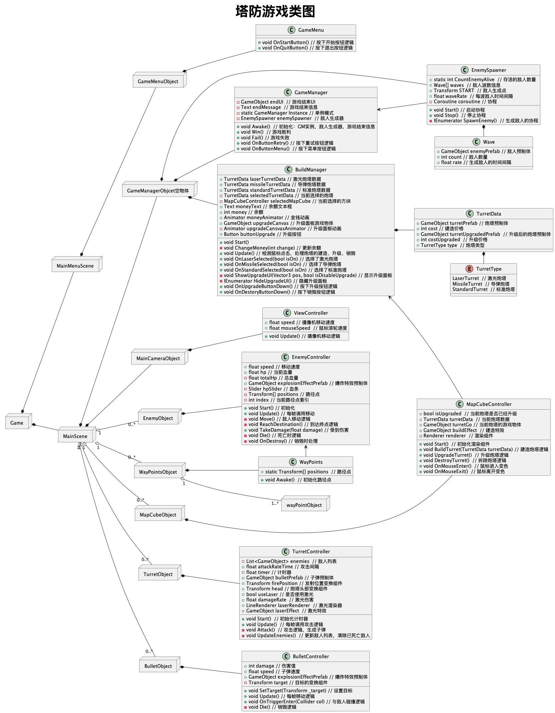

Unity 塔防游戏 
项目概述：开发并实现了一款策略塔防游戏，集成了多样化的游戏元素和动态交互机制。
项目关键点：

- 设计并实现了四种具有不同属性的敌人角色，增加了游戏的挑战性和策略深度。
- 开发了三种基本炮塔及其升级版本，通过精心设计的攻击逻辑和视觉效果，提升了玩家的互动体验。 
- 实现了精准的炮塔与敌人交互系统，包括实时攻击判定和伤害计算。 
- 应用了粒子系统，为游戏打造了精美的特效，增强了视觉冲击力。
- 精心制作了用户界面（UI）和动画效果，提供了直观、流畅的玩家操作体验。

